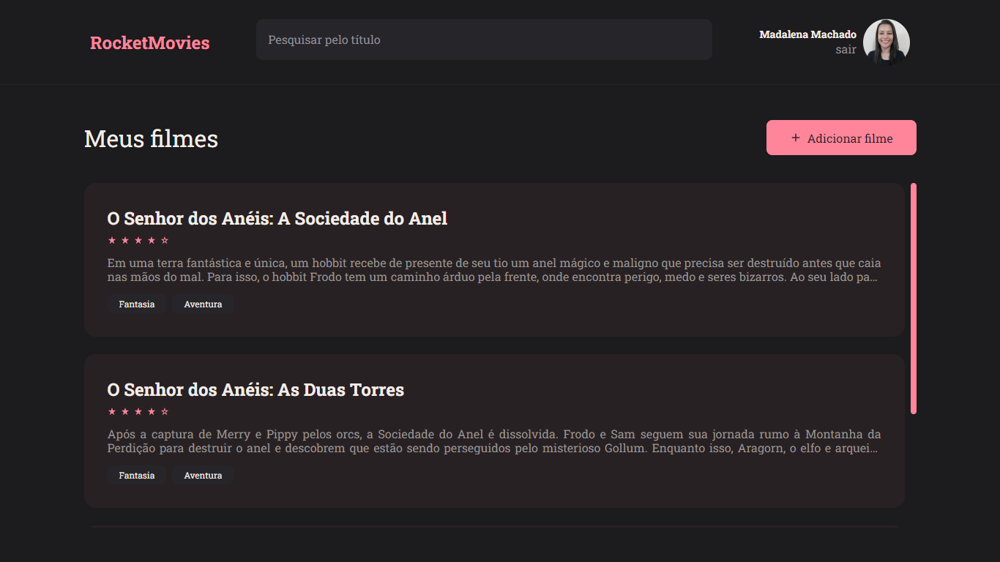

<h1 align="center"> RocketMovies </h1>

> Stage 09: Frontend - Explorer

<p align="center">
  <a href="#project">Projeto</a>&nbsp;&nbsp;&nbsp;|&nbsp;&nbsp;&nbsp;
  <a href="#pages">Páginas</a>&nbsp;&nbsp;&nbsp;|&nbsp;&nbsp;&nbsp;
  <a href="#features">Funcionalidades</a>&nbsp;&nbsp;&nbsp;|&nbsp;&nbsp;&nbsp;
  <a href="#technologies">Tecnologias</a>&nbsp;&nbsp;&nbsp;|&nbsp;&nbsp;&nbsp;
  <a href="#usage">Utilização</a>&nbsp;&nbsp;&nbsp;|&nbsp;&nbsp;&nbsp;
  <a href="#license">Licença</a>
</p>

<p align="center">
  
</p>

<h2 id="project">📁 Projeto</h2>

Frontend do projeto RocketMovies, sua aplicação para acompanhar tudo que assistir!

<h2 id="pages">📃 Páginas</h2>

A aplicação conta com páginas de login, cadastro, visualizar filme, perfil e cadastrar filme.



<h2 id="features">🛠️ Funcionalidades</h2>

A aplicação apresenta as seguintes funcionalidades:

- Login;
- Cadastro;
- Mostrar perfil;
- Atualizar perfil;
- Cadastrar filmes;
- Mostrar filmes cadastradas;
- Filtrar filmes;
- Mostrar detalhes do filme;
- Excluir filme;
- Logout.

<h2 id="technologies">💻 Tecnologias</h2>

Este projeto foi desenvolvido com as seguintes tecnologias:

- ViteJS;
- ReactJS;
- Styled Components;
- React Icons;
- React Router;
- Axios.

<h2 id="usage">💡 Utilização</h2>

A aplicação RocketMovies está disponível para utilização [aqui](https://rocket-movies-app.netlify.app/).

Você também pode instalá-la em sua máquina localmente. Para isso, clone o projeto, acesse a pasta, instale as dependências e inicie o servidor.

```
$ git clone https://github.com/madalena-rocha/rocket-movies
$ cd rocket-movies
$ npm install
$ npm run dev
```

⚠️ **Importante**: Este projeto está utilizando uma hospedagem gratuita para o seu backend, portanto, pode haver atrasos no tempo de resposta do servidor.

<h2 id="license">📝 Licença</h2>

Esse projeto está sob a licença MIT.

---

Feito com ❤️ by Madalena 👋 [Me acompanhe nas redes sociais!](https://madalena-rocha.github.io/social-links/)
