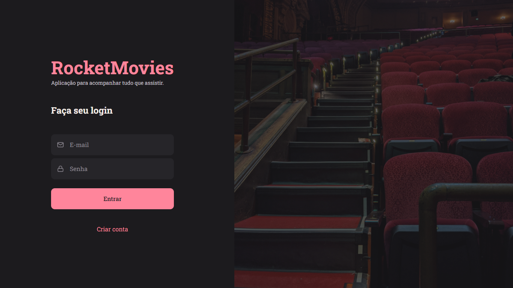
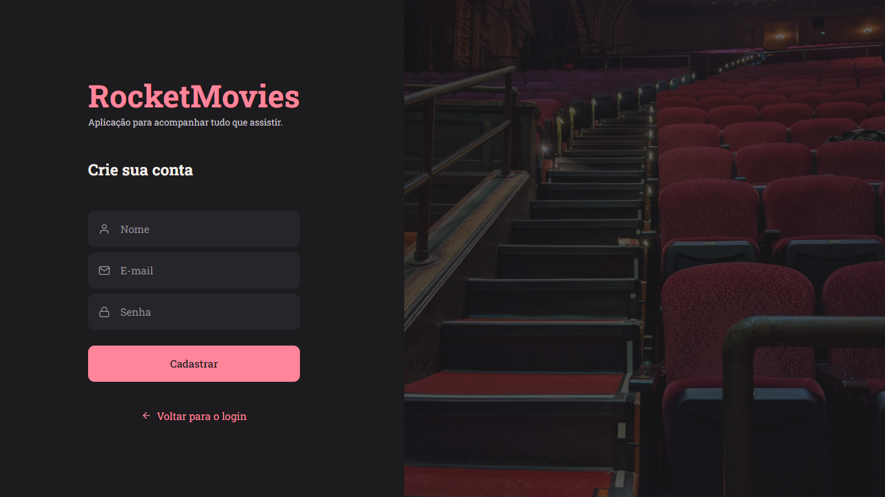
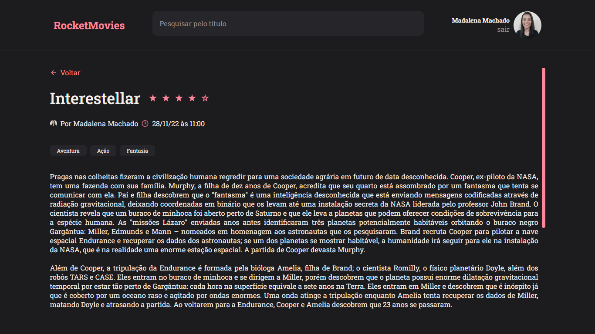
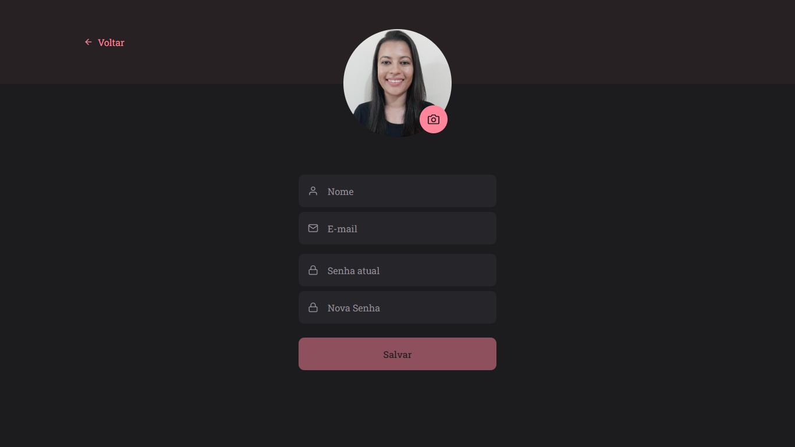
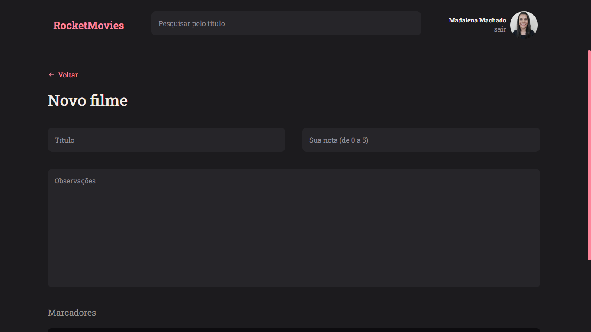

<h1 align="center"> RocketMovies </h1>

> Stage 09: Frontend - Explorer

  <a href="#-tecnologias">Projeto</a>&nbsp;&nbsp;&nbsp;|&nbsp;&nbsp;&nbsp;
  <a href="#-projeto">Páginas</a>&nbsp;&nbsp;&nbsp;|&nbsp;&nbsp;&nbsp;
  <a href="#-layout">Tecnologias</a>&nbsp;&nbsp;&nbsp;|&nbsp;&nbsp;&nbsp;
  <a href="#memo-licença">Licença</a>

  

## :file_folder: Projeto

Frontend do projeto RocketMovies.  
Aplicação para acompanhar tudo que assistir.

## :page_with_curl: Páginas

Página de login:

Página de cadastro:

Página home:

Página de preview da nota:

Página de perfil:

Página de criar nota:

## :computer: Tecnologias

Esse projeto foi desenvolvido com as seguintes tecnologias:

- ViteJS;
- JavaScript;
- ReactJS.

## :memo: Licença

Esse projeto está sob a licença MIT.

---

Feito com :heart: by Madalena :wave: [Me acompanhe nas redes sociais!](https://madalena-rocha.github.io/social-links/)